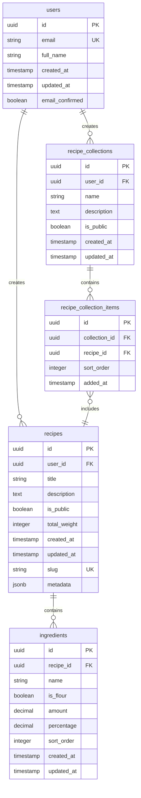

# Baker's Percentage Calculator

A modern web application for calculating baker's percentages and managing bread recipes.

## Features

- **Interactive Recipe Builder**: Add, edit, and reorder ingredients with drag & drop
- **Automatic Calculations**: Convert between percentages and weights automatically
- **URL Sharing**: Recipes are encoded in the URL for easy sharing
- **Responsive Design**: Works on desktop and mobile devices
- **Recipe Management**: Save and organize your favorite recipes (coming soon)

## Database Schema



## Database Features

### Core Features
- **User Authentication**: Secure user registration and login
- **Recipe CRUD**: Create, read, update, delete recipes
- **Ingredient Management**: Flexible ingredient system with baker's percentages
- **URL Sharing**: Maintain current URL-based sharing system

### Advanced Features
- **Collections**: Organize recipes into custom collections (e.g., "Sourdough", "Quick Breads")
- **Public/Private**: Control recipe visibility
- **Search & Discovery**: Find recipes by ingredients, title, or creator

### Technical Features
- **Slugs**: SEO-friendly URLs for public recipes
- **Metadata**: Extensible JSON field for future features
- **Soft Relations**: Recipes can exist without users (for anonymous/URL-based recipes)
- **Audit Trail**: Created/updated timestamps on all entities

## Development

```bash
npm install
npm run dev

# or start the server and open the app in a new browser tab
npm run dev -- --open
```

## Building

To create a production version of your app:

```bash
npm run build
```

You can preview the production build with `npm run preview`.

## Tech Stack

- **Frontend**: SvelteKit, Tailwind CSS, TypeScript
- **Backend**: Supabase (PostgreSQL, Auth, Real-time)
- **Deployment**: Vercel
- **Database**: PostgreSQL with Row Level Security
